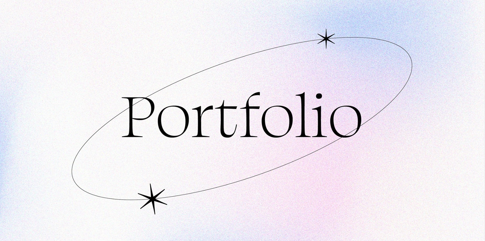

  

  
  
  

Full-Stack Software Engineer, I am driven by a passion for leveraging technology to solve real-world problems and create meaningful, user-centric solutions.
Visit [my website](https://praveensharrma.netlify.app/) for more information!

<h1 align="center">Projects</h1>
<table bordercolor="#66b2b2">
  
  <tr>
    <td width="50%" valign="top">
      <h3 align="center">Stitch & Sole Co.</h3>
         
        
         
        

          
    
      

        
Stitch & Sole Co. is a full-stack e-commerce web application using React, Node.js, and Stripe for payment processing, offering features such as secure user authentication, product management, cart functionality, and dynamic checkout.

    </td>
    <td width="50%" valign="top">
      <h3 align="center">SahandEstate Real Estate</h3>
         
      
         
        

          
  
      

        
SahandEstate is a full-stack real estate platform designed to facilitate seamless property listings, user management, and interactive features for both buyers and sellers.

    </td>
  </tr>
  
  
  
  <tr>
    <td width="50%" valign="top">
      <h3 align="center">OrbitJobs Job Board</h3>
       
        
       
        

  
      

        
An interactive and fully responsive Job Board Platform that simplifies recruitment. Businesses can efficiently create and manage job postings, while candidates can easily reach out to employers through email or phone.

    </td>
    <td width="50%" valign="top">
      <h3 align="center">LAMA AI Chatbot App</h3>
         
        
         
        

          
  
      

        
This is a full-stack ChatGPT-like application, created to build an interactive and intelligent chatbot capable of real-time conversations, providing insightful responses to user queries.

    </td>
  </tr>
  
   
   <tr>
    <td width="50%" valign="top">
      <h3 align="center">IMAGINIFY AI SaaS</h3>
       
        
       
        

  
      

        
Full-stack AI image SaaS platform offering cutting-edge image processing solutions. It features a robust payment system, advanced image search capabilities, and a suite of AI-powered tools, including image restoration, recoloring, object removal, generative filling, and 
           background removal.

    </td>
    <td width="50%" valign="top">
      <h3 align="center">Zentree Award Winning Website</h3>
         
        
         
        

          
  
      

        
An award-winning animated website that became Site Of The Month. Featuring interactive scroll-based animations, sleek geometric transitions, and captivating video content, this platform offers an engaging and visually dynamic 
           user experience.

    </td>
  </tr>

  <tr>
    <td width="50%" valign="top">
      <h3 align="center"> Apple iPhone 15 Pro Website </h3>
       
        
       
        

  
      

        
The website showcases the Apple iPhone 15 Pro, combining the power of GSAP animations with the advanced 3D capabilities of Three.js.

    </td>
    <td width="50%" valign="top">
      <h3 align="center">My Portfolio</h3>
         
        
         
        

          
  
      

        
This portfolio showcases my diverse projects, including e-commerce and AI-powered apps, built with modern technologies like React, Tailwind CSS, GSAP, and Lenis, demonstrating my ability to create seamless, user-friendly, and visually engaging web experiences.

    </td>
  </tr>

</table>

<h1 align="center">Technologies</h1>

)

---

